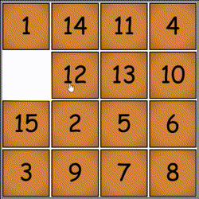

# Game of Fifteen (aka 15 puzzle)

Simple JavaScript implementation of the [Game of Fifteen](https://en.wikipedia.org/wiki/15_puzzle) I wrote in Jun 2019. To try out live, visit https://qbject.github.io/the_game_of_fifteen

## Special features

-   Fancy shuffle animation
-   Fancy winning animation
-   Tile move audio
